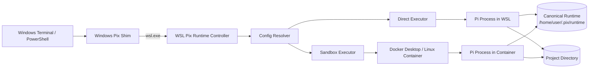
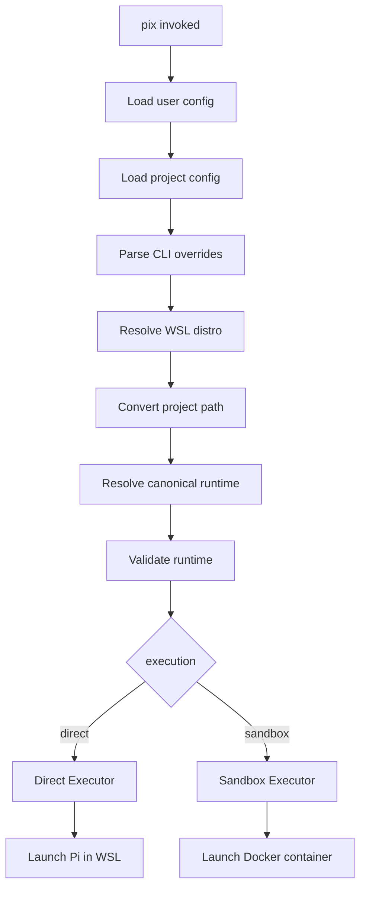

# Pix 单一运行时架构与实现蓝图

> 面向编码 Agent 的实现说明  
> 项目：`@reiutsuho/pix`  
> 目标环境：Windows 11 + WSL2 + Docker Desktop  
> 状态：Implementation Blueprint / Draft

---

## 1. 背景

当前 Pix 将 Windows 宿主机目录直接 bind mount 到 Linux 容器：

- 当前项目目录挂载到 `/workspace`
- Windows 用户的 `~/.pi` 挂载到 `/root/.pi`

在未安装大量扩展时，这种方式可以正常工作；安装插件后，Pi 启动阶段需要扫描 package、解析 `package.json`、加载 extension、遍历 skill 和访问大量 `node_modules` 小文件。Windows NTFS 经 Docker Desktop 文件共享层进入 Linux 容器后，这类高频小文件操作会产生明显性能损失。

Pix 需要同时支持两种使用场景：

1. 普通项目：不需要 Docker 权限隔离，直接运行 Pi。
2. 敏感项目：需要限制 Agent 的文件、进程和网络访问，在 Docker 中运行 Pi。

本设计不维护两套 Pi runtime，也不在 Windows 与容器之间同步两份插件和配置。系统只维护一份位于 WSL2 Linux 文件系统中的 canonical runtime，并为它提供两种执行策略。

---

## 2. 核心设计结论

### 2.1 单一物理 Runtime

Pix 只维护一份 Pi 运行时目录：

```text
/home/<user>/.pix/runtime/
```

该目录位于 WSL2 的 Linux 文件系统中，不位于：

```text
C:\Users\...
/mnt/c/Users/...
Docker named volume
```

Direct 和 Sandbox 都访问这同一个目录。

### 2.2 Execution Policy，而不是两个 Runtime

Pix 对外暴露两种执行策略：

```text
direct
sandbox
```

两者不是两套环境：

```text
                    ┌── direct: WSL 中直接执行 Pi
Canonical Runtime ──┤
                    └── sandbox: Docker 中执行 Pi
```

### 2.3 Git 只负责可版本化内容

Git 用于保存和远程同步：

- Pi 配置声明
- 自定义 extensions 源码
- skills
- prompts
- themes
- `package.json`
- `pnpm-lock.yaml`

Git 不负责保存：

- `auth.json`
- `trust.json`
- sessions
- npm/git package checkout
- `node_modules`
- pnpm store
- cache
- 临时锁文件

### 2.4 Pix 不实现双向目录同步

Pix 不在 native 与 container 之间复制文件，因为它们访问同一个 runtime。

Pix 只负责：

- 定位 WSL distro
- 定位 canonical runtime
- 创建目录
- 解析 execution policy
- 将 Windows 路径转换成 WSL 路径
- 在 WSL 中直接执行 Pi，或启动 Docker
- 可选执行 Git 更新与依赖安装 hook
- 检查环境和输出诊断信息

---

## 3. 目标与非目标

## 3.1 目标

- Direct 与 Sandbox 使用同一套 Pi 配置、插件、凭据和会话。
- 消除容器读取 Windows NTFS 上大量插件小文件的性能问题。
- 项目可以通过 `.pix.json` 声明是否启用沙箱。
- Windows PowerShell、CMD 和 Windows Terminal 中仍可直接执行 `pix`。
- 配置和自定义 extension 可以继续通过 Git 远程同步。
- 容器可以被删除和重建，而不丢失 runtime。
- 默认实现保持简单，不在第一阶段引入 overlayfs。
- 为未来只读 runtime、Copy-on-Write sandbox 留出扩展位置。

## 3.2 非目标

第一阶段不实现：

- Windows 原生 Node 进程直接运行 Pi。
- Windows NTFS 与 Docker volume 之间的实时双向同步。
- 完整的 Git GUI 或冲突解决器。
- 自动提交或自动 push。
- 多 profile、多 runtime。
- Kubernetes、远程 Docker host。
- 跨 Linux distro 共享同一 runtime。
- sandbox 对 runtime 的写时复制隔离。
- 多个 Pi 进程并发写同一个 runtime 的冲突治理。

---

## 4. 总体架构



核心约束：

```text
Direct Pi 与 Container Pi 必须解析到同一个物理 runtime。
```

---

## 5. Runtime 目录结构

推荐目录：

```text
/home/<user>/.pix/
├── runtime/
│   ├── agent/                     # PI_CODING_AGENT_DIR
│   │   ├── settings.json
│   │   ├── auth.json
│   │   ├── trust.json
│   │   ├── npm/
│   │   ├── git/
│   │   ├── sessions/
│   │   ├── extensions/
│   │   ├── skills/
│   │   ├── prompts/
│   │   ├── themes/
│   │   └── bin/
│   │
│   ├── profile/                   # Git 仓库，仅保存可版本化内容
│   │   ├── .git/
│   │   ├── pi/
│   │   │   ├── settings.template.json
│   │   │   ├── skills/
│   │   │   ├── prompts/
│   │   │   └── themes/
│   │   ├── extensions/
│   │   ├── package.json
│   │   ├── pnpm-workspace.yaml
│   │   ├── pnpm-lock.yaml
│   │   └── scripts/
│   │
│   ├── pnpm-store/
│   ├── state/
│   │   ├── bootstrap.json
│   │   └── dependency-state.json
│   └── locks/
│
└── config.json                    # Pix 全局配置，可选
```

### 5.1 Pi Agent Directory

Pi 支持通过环境变量指定用户级 Agent 配置目录：

```bash
PI_CODING_AGENT_DIR=/home/<user>/.pix/runtime/agent
```

Direct 和 Sandbox 必须设置相同的逻辑值。

为了避免容器中的路径不同，推荐将整个 runtime 以“相同绝对路径”挂载进容器：

```text
WSL Host:
/home/zero/.pix/runtime

Container:
/home/zero/.pix/runtime
```

容器内继续设置：

```bash
PI_CODING_AGENT_DIR=/home/zero/.pix/runtime/agent
```

不要继续依赖 `/root/.pi` 作为容器专用路径，否则 profile 中的绝对路径在 Direct 和 Sandbox 模式下可能不一致。

### 5.2 Git Profile

`runtime/profile` 是唯一 Git checkout。

Direct 和 Sandbox 都读取这一 checkout，不需要：

```text
Windows clone → push → container clone → pull
```

而是：

```text
同一个 WSL Git checkout
├── Direct 读取
└── Sandbox 读取
```

### 5.3 Runtime State

`runtime/agent` 和 `runtime/state` 不应整体进入 Git。

推荐 `.gitignore`：

```gitignore
node_modules/
.pnpm-store/
dist/
coverage/
*.log

# Pi runtime state
auth.json
trust.json
sessions/
npm/
git/
cache/
locks/
```

不要忽略：

```text
pnpm-lock.yaml
```

---

## 6. 配置协议

## 6.1 全局配置

Windows 用户配置文件：

```text
%USERPROFILE%\.pixrc.json
```

建议 schema：

```json
{
  "wsl": {
    "distro": "Ubuntu",
    "runtimeRoot": "~/.pix/runtime"
  },
  "execution": "direct",
  "profile": {
    "repository": "git@github.com:UTSUHO/pi-profile.git",
    "ref": "main",
    "autoClone": true,
    "autoPull": false,
    "pullPolicy": "ff-only"
  },
  "dependencies": {
    "manager": "pnpm",
    "installOnLockfileChange": true,
    "frozenLockfile": true
  },
  "container": {
    "image": "pix-pi-sandbox",
    "runtimeAccess": "read-write",
    "network": "bridge",
    "workspaceAccess": "read-write",
    "extraRunOptions": []
  },
  "envAllowlist": [
    "ANTHROPIC_API_KEY",
    "ANTHROPIC_BASE_URL",
    "OPENAI_API_KEY",
    "OPENAI_BASE_URL",
    "GOOGLE_API_KEY",
    "AZURE_OPENAI_API_KEY",
    "AZURE_OPENAI_ENDPOINT",
    "HTTP_PROXY",
    "HTTPS_PROXY",
    "NO_PROXY",
    "DEBUG"
  ]
}
```

## 6.2 项目配置

项目根目录：

```text
.pix.json
```

普通项目：

```json
{
  "execution": "direct"
}
```

需要隔离的项目：

```json
{
  "execution": "sandbox",
  "container": {
    "workspaceAccess": "read-write",
    "network": "none"
  }
}
```

允许项目配置覆盖：

- `execution`
- `container.runtimeAccess`
- `container.workspaceAccess`
- `container.network`
- `container.extraRunOptions`
- 环境变量白名单的增量配置

项目配置不应覆盖：

- WSL distro
- canonical runtimeRoot
- profile repository

原因是这些字段定义单一 runtime 的身份，不应由每个项目切换。

## 6.3 配置优先级

```text
CLI 参数
  >
项目 .pix.json
  >
用户 ~/.pixrc.json
  >
默认值
```

示例：

```bash
pix --direct
pix --sandbox
pix --sandbox --network none
```

CLI 只覆盖本次运行，不写回配置文件。

---

## 7. 命令设计

第一阶段建议提供：

```text
pix
pix --direct
pix --sandbox
pix init
pix status
pix doctor
pix sync
pix install
pix --dry-run
```

### 7.1 `pix`

根据配置解析 execution policy，随后启动 Pi。

### 7.2 `pix --direct`

强制在 WSL 中直接运行 Pi。

### 7.3 `pix --sandbox`

强制在 Docker 中运行 Pi。

### 7.4 `pix init`

执行首次初始化：

1. 检查 WSL。
2. 检查指定 distro。
3. 创建 runtime 目录。
4. 检查 Node、Pi、Git、pnpm。
5. clone profile repository。
6. 安装 profile dependencies。
7. 创建或合并 Pi settings。
8. 输出初始化结果。

### 7.5 `pix status`

输出：

```text
Execution: sandbox
WSL distro: Ubuntu
Runtime root: /home/zero/.pix/runtime
Agent dir: /home/zero/.pix/runtime/agent
Profile branch: main
Profile commit: abc1234
Profile dirty: no
Pi available: yes
Docker available: yes
Workspace path: /home/zero/projects/demo
Workspace storage: WSL filesystem
```

### 7.6 `pix doctor`

检查并分类问题：

- WSL 未安装
- distro 不存在
- Docker Desktop 未启动
- WSL integration 未开启
- runtime 位于 `/mnt/c`
- project 位于 `/mnt/c`
- Pi 不存在
- Node 版本不匹配
- container image 不存在
- profile 仓库 dirty
- Git 无法认证
- pnpm lockfile 与安装状态不一致
- Windows 和 WSL 路径转换失败
- runtime 权限异常

### 7.7 `pix sync`

显式执行：

```text
git fetch
git pull --ff-only
pnpm install --frozen-lockfile
可选 build
```

第一阶段默认不建议每次启动自动 pull。

原因：

- 启动命令不应默认被网络阻塞。
- 用户可能有未提交修改。
- 远程仓库可能出现冲突。
- 离线场景仍应可以运行。
- Git 更新失败不应阻止使用已有 runtime。

可通过配置启用：

```json
{
  "profile": {
    "autoPull": true
  }
}
```

即便开启，也只能执行：

```bash
git pull --ff-only
```

禁止自动 merge、rebase、commit 或 reset。

### 7.8 `pix install`

在 canonical runtime 中执行依赖安装，不区分 Direct 和 Sandbox：

```bash
cd ~/.pix/runtime/profile
pnpm install --frozen-lockfile
pnpm build
```

---

## 8. 启动流程

## 8.1 通用流程



## 8.2 Direct 模式

Windows shim 最终执行：

```powershell
wsl.exe -d Ubuntu -- bash -lc "<escaped-command>"
```

WSL 内部命令：

```bash
export PI_CODING_AGENT_DIR="$HOME/.pix/runtime/agent"
export PNPM_HOME="$HOME/.local/share/pnpm"

cd "/home/zero/projects/example"
exec pi "$@"
```

要求：

- 使用 `spawn`，不使用字符串拼接 shell 命令处理用户参数。
- 如果必须经过 shell，只允许固定模板，并对路径和参数做严格 shell escaping。
- stdin/stdout/stderr 必须继承。
- TTY 信号应尽可能透传。
- 退出码必须原样返回。

## 8.3 Sandbox 模式

Docker 启动示例：

```bash
docker run --rm -it \
  --workdir /workspace \
  --env PI_CODING_AGENT_DIR=/home/zero/.pix/runtime/agent \
  --mount type=bind,src=/home/zero/.pix/runtime,dst=/home/zero/.pix/runtime \
  --mount type=bind,src=/home/zero/projects/example,dst=/workspace \
  pix-pi-sandbox \
  pi
```

关键约束：

1. runtime 在容器内保持相同绝对路径。
2. project 推荐位于 WSL Linux 文件系统。
3. 不再挂载 Windows `C:\Users\...\ .pi`。
4. 不再使用 `/host_mnt/c/...` 作为插件目录。
5. 容器内 `PI_CODING_AGENT_DIR` 与 Direct 模式一致。

---

## 9. Windows 路径与 WSL 路径

## 9.1 路径分类

Pix 应识别三类当前工作目录：

### WSL UNC 路径

```text
\\wsl$\Ubuntu\home\zero\projects\demo
```

转换为：

```text
/home/zero/projects/demo
```

### Windows NTFS 路径

```text
C:\Users\Zero\projects\demo
```

转换为：

```text
/mnt/c/Users/Zero/projects/demo
```

可以运行，但应输出性能警告：

```text
[pix] Warning: workspace is stored on Windows NTFS.
[pix] Sandbox file operations may be slower.
[pix] Recommended: move the repository under /home/<user>/projects.
```

### 已在 WSL 内调用

直接使用当前 Linux 路径。

## 9.2 路径转换实现

优先调用：

```bash
wsl.exe -d <distro> -- wslpath -a '<windows-path>'
```

不要自行维护复杂的盘符、UNC、空格和 Unicode 转换规则。

可以保留简单转换作为 fallback，但必须有测试覆盖。

---

## 10. Profile 与 Pi Settings 的连接方式

推荐由 runtime bootstrap 生成：

```text
~/.pix/runtime/agent/settings.json
```

该文件中的自定义资源引用 canonical profile：

```json
{
  "extensions": [
    "/home/zero/.pix/runtime/profile/extensions"
  ],
  "skills": [
    "/home/zero/.pix/runtime/profile/pi/skills"
  ],
  "prompts": [
    "/home/zero/.pix/runtime/profile/pi/prompts"
  ],
  "themes": [
    "/home/zero/.pix/runtime/profile/pi/themes"
  ],
  "packages": [
    "npm:@example/pi-extension@1.2.3"
  ]
}
```

由于容器内保持相同绝对路径，同一份 `settings.json` 可以被两种 execution policy 使用。

## 10.1 Settings 合并原则

不要在每次启动时直接覆盖用户 settings。

实现一个受管字段合并器：

```text
Profile-managed fields:
- extensions
- skills
- prompts
- themes
- packages

Runtime-local fields:
- model/provider
- UI settings
- retry settings
- session settings
- auth
- trust
```

更简单的第一阶段可以规定：

```text
profile/pi/settings.json 是完整 settings.json 的来源。
```

然后复制到：

```text
runtime/agent/settings.json
```

但复制必须显式执行：

```bash
pix sync
```

不要在每次启动时静默覆盖。

---

## 11. pnpm 与 Extension 管理

## 11.1 标准 Pi Package

已发布为 Pi package 的组件继续由 Pi 原生 package system 管理：

```json
{
  "packages": [
    "npm:@scope/pi-extension@1.0.0",
    "git:github.com/example/pi-tools@v1"
  ]
}
```

不要让 Pix 再实现一套 npm package installer。

## 11.2 自研 Extension Workspace

自研 extension 由 profile 仓库和 pnpm workspace 管理：

```text
profile/
├── extensions/
│   ├── npm-audit/
│   ├── code-review/
│   └── docker-tools/
├── package.json
├── pnpm-workspace.yaml
└── pnpm-lock.yaml
```

`pnpm-workspace.yaml`：

```yaml
packages:
  - "extensions/*"
```

Pix 只负责调用：

```bash
pnpm install --frozen-lockfile
pnpm -r build
```

## 11.3 Store 与 node_modules

推荐：

```text
pnpm store:
~/.pix/runtime/pnpm-store
```

配置：

```bash
pnpm config set store-dir ~/.pix/runtime/pnpm-store
```

因为 Direct 和 Sandbox 共享同一 Linux runtime，第一阶段可以共享 profile 的 `node_modules`。

前提：

- WSL 和容器 CPU 架构相同。
- Node major version 相同。
- libc 环境兼容。
- extension 不包含不兼容 native addon。

若后续出现 native dependency 兼容问题，再演进为：

```text
共享 pnpm store
分离 direct node_modules 与 sandbox node_modules
```

第一阶段不要提前增加这层复杂度。

---

## 12. 容器镜像

Dockerfile 建议：

```dockerfile
FROM node:24-bookworm-slim

ENV NODE_OPTIONS=--dns-result-order=ipv4first
ENV PREFER_IPV4=true

RUN apt-get update \
    && apt-get install -y --no-install-recommends \
       bash \
       ca-certificates \
       git \
       openssh-client \
       ripgrep \
       pnpm \
    && rm -rf /var/lib/apt/lists/*

RUN npm install -g --ignore-scripts @earendil-works/pi-coding-agent

WORKDIR /workspace

ENTRYPOINT ["pi"]
```

注意：

- WSL Direct 环境与容器尽量固定相同 Node major。
- 如果 pnpm 不能由 apt 稳定提供，使用 Corepack。
- 镜像中不要预装用户 extensions。
- 用户 extensions 来自 shared runtime。

---

## 13. Sandbox 权限模型

## 13.1 第一阶段：Read-Write Runtime

```json
{
  "execution": "sandbox",
  "container": {
    "runtimeAccess": "read-write"
  }
}
```

runtime 挂载为读写。

优点：

- Direct 与 Sandbox 行为一致。
- 登录、插件安装、配置修改和 session 保存均可工作。
- 实现简单。

风险：

- Sandbox 中运行的 extension 可以修改公共 runtime。
- 容器隔离只保护 runtime 之外的文件系统。
- 不适合执行完全不可信的插件。

## 13.2 未来阶段：Read-Only Runtime

```json
{
  "container": {
    "runtimeAccess": "read-only"
  }
}
```

runtime 使用只读挂载：

```bash
--mount type=bind,src=<runtime>,dst=<runtime>,readonly
```

但 Pi 需要写 session、cache、lock 和部分配置，因此必须增加独立 writable state。

## 13.3 未来阶段：Overlay Runtime

```json
{
  "container": {
    "runtimeAccess": "overlay"
  }
}
```

语义：

```text
shared runtime = lowerdir, read-only
sandbox state  = upperdir
container view = merged
```

该功能不纳入第一阶段。

原因：

- Docker Desktop + WSL2 下 overlay mount 的实现与权限处理复杂。
- 需要处理 session 持久化、auth 修改和插件安装导出。
- 当前主要问题是性能，不是保护公共 runtime。

---

## 14. 并发与锁

单 runtime 意味着两个进程可能同时写入：

```text
Direct Pi
Sandbox Pi
```

第一阶段明确限制：

```text
同一 runtime 默认只允许一个 Pix/Pi 会话。
```

实现锁文件：

```text
~/.pix/runtime/locks/runtime.lock
```

启动流程：

1. 尝试创建独占锁。
2. 锁已存在时检查 PID 是否仍存活。
3. 默认拒绝第二个会话。
4. 提供 `--allow-concurrent` 作为高级选项。
5. 退出时释放锁。
6. 异常退出后 `pix doctor --repair` 可以清理 stale lock。

不要只依赖 `auth.json` 自身的文件锁，因为其他 settings、package 和 session 操作仍可能冲突。

---

## 15. 安全边界

必须在文档和 CLI 中明确：

> 共享同一个 read-write runtime 意味着 Sandbox 可以修改该 runtime。它不是针对恶意 extension 的完全隔离。

Sandbox 第一阶段保护：

- 未挂载的 Windows 文件
- 未挂载的 WSL 文件
- 宿主机进程空间
- 宿主机系统目录
- 可选网络访问

Sandbox 第一阶段不保护：

- shared runtime
- 当前 workspace
- 传入容器的环境变量
- Docker socket（默认禁止挂载）
- 用户显式挂载的其他目录

默认禁止：

```text
/var/run/docker.sock
/home/<user>
/mnt/c
/root
SSH agent socket
全量宿主环境变量
```

只允许显式白名单环境变量。

---

## 16. 代码模块拆分

当前 `bin/pix.js` 集中了配置、路径、Docker 和执行逻辑。建议重构为：

```text
bin/
└── pix.js                         # CLI entry

src/
├── cli/
│   ├── parse-args.js
│   ├── commands/
│   │   ├── run.js
│   │   ├── init.js
│   │   ├── sync.js
│   │   ├── status.js
│   │   └── doctor.js
│   └── output.js
│
├── config/
│   ├── defaults.js
│   ├── load-config.js
│   ├── merge-config.js
│   ├── validate-config.js
│   └── schema.js
│
├── platform/
│   ├── windows.js
│   ├── wsl.js
│   └── paths.js
│
├── runtime/
│   ├── resolve-runtime.js
│   ├── initialize-runtime.js
│   ├── runtime-lock.js
│   ├── runtime-state.js
│   └── settings-linker.js
│
├── profile/
│   ├── git-profile.js
│   ├── dependency-manager.js
│   └── profile-state.js
│
├── executors/
│   ├── direct-executor.js
│   └── sandbox-executor.js
│
├── docker/
│   ├── image.js
│   ├── compose.js
│   ├── mounts.js
│   └── policies.js
│
└── process/
    ├── spawn.js
    ├── escaping.js
    └── signals.js
```

## 16.1 模块职责

### `platform/wsl.js`

- 检测 WSL
- 列出 distro
- 选择 distro
- 执行 WSL 命令
- 路径转换
- 获取 WSL home

### `runtime/resolve-runtime.js`

- 展开 `~`
- 返回 canonical runtime 绝对路径
- 拒绝 `/mnt/c` 下的 runtime
- 构造 agent/profile/store/state/lock 路径

### `executors/direct-executor.js`

- 在 WSL 中运行 Pi
- 设置 `PI_CODING_AGENT_DIR`
- 切换工作目录
- 透传参数与 TTY

### `executors/sandbox-executor.js`

- 构造 Docker 参数
- 挂载 runtime 和 workspace
- 设置同一 `PI_CODING_AGENT_DIR`
- 应用 network、read-only、capability 等策略
- 不负责 profile 同步

### `profile/git-profile.js`

- clone
- status
- fetch
- ff-only pull
- 不自动解决冲突

### `profile/dependency-manager.js`

- 计算 lockfile hash
- 判断是否需要 install
- 执行 frozen install
- 保存成功状态

---

## 17. 需要修改的现有逻辑

当前实现中的以下设计应移除或替换：

## 17.1 移除 Host Pi Home 二选一

移除核心依赖：

```text
useHostPiHome
piHomeHostPath
useHostAgentHome
agentHomeHostPath
```

迁移期间可以保留 deprecated 解析和警告，但新执行路径不再使用。

## 17.2 移除 Windows `~/.pi` → `/root/.pi`

不再生成：

```text
C:\Users\<user>\.pi:/root/.pi
```

替换为：

```text
/home/<user>/.pix/runtime:/home/<user>/.pix/runtime
```

## 17.3 修正 Pi 目录环境变量

Pix 应使用：

```text
PI_CODING_AGENT_DIR
```

而不是把 `PI_AGENT_HOME` 作为主要运行时目录控制变量。

建议保留 `PI_AGENT_HOME` 的普通透传能力，但 Pix 自己生成和控制的是：

```bash
PI_CODING_AGENT_DIR=<runtime>/agent
```

## 17.4 Docker Context

当前专用 Docker context 不是单 runtime 架构的必要条件。

第一阶段可以保留以减少变更，也可以简化为当前 Docker Desktop context。

如果保留，必须确保：

- Docker CLI 从 WSL 中调用。
- context endpoint 对 WSL 可用。
- bind mount 源路径是 WSL Linux 路径。

## 17.5 Daemon Mode

当前 daemon 只复用容器，不复用 Pi 进程，因此不能避免插件加载。

新版本不应宣传：

```text
daemon makes Pi startup instant
```

可将 daemon 暂时删除，或者改名为：

```text
keep-container
```

并明确它只能减少容器创建成本。

---

## 18. 实现阶段

## Phase 1：建立 WSL 单 Runtime

任务：

- 增加 WSL 检测与路径转换。
- 增加 `runtimeRoot`。
- 增加 `PI_CODING_AGENT_DIR`。
- 实现 Direct executor。
- 实现 Sandbox executor。
- 将 runtime 同路径挂载进容器。
- 增加 runtime lock。
- 保留现有 CLI 参数透传。
- 增加 `pix status` 和 `pix doctor`。

完成标志：

- Direct 和 Sandbox 读取同一个 settings、auth 和 package。
- 任一模式安装插件后，另一模式立即可见。
- 不发生复制或同步。
- Container 插件加载不再经过 NTFS。

## Phase 2：Git Profile

任务：

- 增加 profile repository 配置。
- 实现 `pix init`。
- 实现 `pix sync`。
- 实现 `git pull --ff-only`。
- 实现 dirty working tree 检测。
- 实现 profile status。
- 禁止自动 merge/rebase/reset。

完成标志：

- profile 只有一个 WSL checkout。
- Direct 与 Sandbox 读取同一个 profile。
- 离线时仍可运行现有 runtime。

## Phase 3：pnpm Workspace

任务：

- 支持 pnpm workspace。
- 记录 lockfile hash。
- 仅 lockfile 变化时安装。
- 增加 build hook。
- 增加失败回滚状态。

完成标志：

- 未变化时启动不执行 `pnpm install`。
- 依赖更新后两种模式同时可见。
- profile node_modules 不位于 NTFS。

## Phase 4：Sandbox Policy

任务：

- network policy
- workspace read-only
- drop capabilities
- no-new-privileges
- resource limits
- env allowlist
- read-only runtime 实验支持

完成标志：

- 默认不挂载 Docker socket。
- 默认不传递全量环境变量。
- 能通过项目配置禁用网络。
- 能将 workspace 挂载为只读。

## Phase 5：Overlay Runtime

暂不实现，仅保留接口。

---

## 19. 测试计划

## 19.1 单元测试

### 配置

- user config + project config + CLI precedence
- invalid execution policy
- runtimeRoot 位于 `/mnt/c` 时拒绝或警告
- 项目不能覆盖 runtime identity

### 路径

- `C:\repo`
- 含空格路径
- 中文路径
- UNC WSL 路径
- WSL Linux 路径
- 不同 distro

### 命令参数

- `pix --help`
- Pi 参数完整透传
- 引号、空格、反斜杠
- stdin 非 TTY
- exit code 透传

### Git

- initial clone
- clean ff-only update
- dirty tree
- divergent branch
- offline fetch failure
- invalid credentials

### Runtime lock

- 单会话
- 并发会话拒绝
- stale lock
- 异常退出清理

## 19.2 集成测试

### Direct → Sandbox

1. Direct 模式登录。
2. Direct 模式安装插件。
3. Sandbox 模式启动。
4. 验证 auth 和插件立即可见。

### Sandbox → Direct

1. Sandbox 模式修改 settings。
2. 退出容器。
3. Direct 模式启动。
4. 验证修改立即可见。

### 容器销毁

1. 启动 Sandbox。
2. 删除容器。
3. 再次启动。
4. 验证 runtime 数据仍然存在。

### 性能

测试矩阵：

```text
A. Windows NTFS bind-mounted Pi Home
B. WSL canonical runtime + Direct
C. WSL canonical runtime + Sandbox
```

记录：

- Pi 进程启动到首屏时间
- extension discovery 时间
- package scan 时间
- 第一次启动与热缓存启动
- 不同插件数量下的变化

预期：

```text
C 应接近 B，且显著快于 A。
```

## 19.3 安全测试

- Sandbox 无法访问未挂载的 `/home/<user>`
- Sandbox 无法访问 `/mnt/c`
- Docker socket 不存在
- `network: none` 生效
- env allowlist 生效
- workspace read-only 生效

---

## 20. 验收标准

功能验收：

- [ ] Pix 在 Windows 中可直接调用。
- [ ] Pix 可以选择 Direct 或 Sandbox。
- [ ] 两种模式使用同一个 `PI_CODING_AGENT_DIR`。
- [ ] 两种模式读取同一份 settings。
- [ ] 两种模式读取同一份 auth。
- [ ] 一端安装的 Pi package 在另一端立即可见。
- [ ] 一端修改的 extension 源码在另一端立即可见。
- [ ] 删除容器不会删除 runtime。
- [ ] 项目 `.pix.json` 可以选择 execution policy。
- [ ] `pix doctor` 能识别 NTFS workspace。
- [ ] Git 仓库冲突不会被 Pix 自动覆盖。
- [ ] 离线状态下 Direct 与 Sandbox 都能运行已有环境。

性能验收：

- [ ] 安装同一组插件后，Sandbox 启动延迟不再比 Direct 多约 30 秒。
- [ ] runtime 中的 package 和 `node_modules` 不经过 Windows bind mount。
- [ ] 未发生 profile 变化时，不执行 `pnpm install`。
- [ ] 普通 `pix` 启动不被无条件 Git 网络请求阻塞。

安全验收：

- [ ] 默认不挂载 Docker socket。
- [ ] 默认不传入完整宿主环境变量。
- [ ] 可禁用容器网络。
- [ ] 可将 workspace 设置为只读。
- [ ] CLI 明确提示 read-write shared runtime 的隔离边界。

---

## 21. Agent 实施约束

实现 Agent 必须遵守：

1. 不引入第二份 Pi runtime。
2. 不通过文件复制维持 Direct/Sandbox 一致性。
3. 不把 Windows `~/.pi` 挂载到容器。
4. canonical runtime 必须位于 WSL Linux filesystem。
5. Direct 和 Sandbox 必须使用相同的 `PI_CODING_AGENT_DIR`。
6. runtime 在容器内必须保持相同绝对路径。
7. 不自动执行 Git merge、rebase、reset、commit 或 push。
8. 不在每次启动无条件执行 `pnpm install`。
9. 不默认挂载 Docker socket。
10. 不默认传递所有环境变量。
11. 不把 daemon container 等同于常驻 Pi 进程。
12. 所有子进程必须透传退出码。
13. 所有用户参数必须以 argv 形式传递，避免 shell injection。
14. Windows、WSL 和 Docker 路径转换必须有测试。
15. 先完成 Phase 1，再实现 Git/profile 自动化。

---

## 22. 建议的首个实现 PR

首个 PR 只完成最小闭环：

### 修改范围

- 将当前单文件拆出基础 config、WSL 和 executor 模块。
- 增加 `execution: direct | sandbox`。
- 增加 `wsl.distro`。
- 增加 `wsl.runtimeRoot`。
- 新增 Direct executor。
- Sandbox 改为从 WSL 调用 Docker。
- runtime 同路径挂载。
- 设置 `PI_CODING_AGENT_DIR`。
- 新增 `pix status`。
- 新增性能与路径警告。
- 暂不实现 Git auto pull。
- 暂不实现 pnpm hash。
- 暂不实现 overlay。

### PR 验收脚本

```bash
# WSL 初始化
mkdir -p ~/.pix/runtime/agent

# Direct
pix --direct

# 在 Direct Pi 中安装测试插件
pi install npm:<test-package>

# Sandbox
pix --sandbox

# 确认同一个插件无需重新安装即可加载
```

容器内检查：

```bash
echo "$PI_CODING_AGENT_DIR"
realpath "$PI_CODING_AGENT_DIR"
ls -la "$PI_CODING_AGENT_DIR"
```

Direct 与 Sandbox 输出必须指向同一个 runtime：

```text
/home/<user>/.pix/runtime/agent
```

---

## 23. 最终架构摘要

```text
Windows CLI
    │
    ▼
WSL Pix Controller
    │
    ├── Direct execution
    │      └── Pi process in WSL
    │
    └── Sandbox execution
           └── Pi process in Docker
                    │
                    ▼
      One Canonical WSL Runtime
      ~/.pix/runtime
```

最终原则：

> Pix 只维护一个位于 WSL2 Linux 文件系统中的 Pi runtime。项目只选择执行策略，不选择 runtime。Direct 在 WSL 中运行，Sandbox 在 Docker 中运行，两者通过相同绝对路径和 `PI_CODING_AGENT_DIR` 访问同一份配置、插件和状态。Git 只管理 profile，Pix 不实现两套环境之间的同步。
