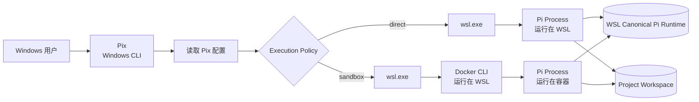
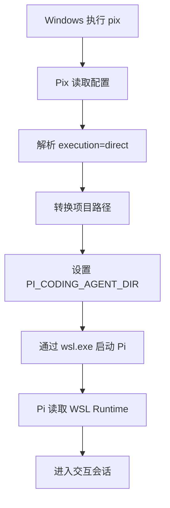
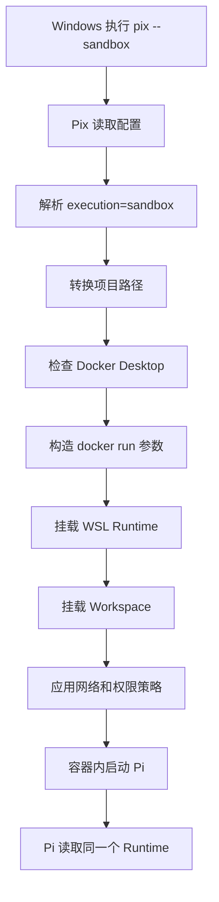
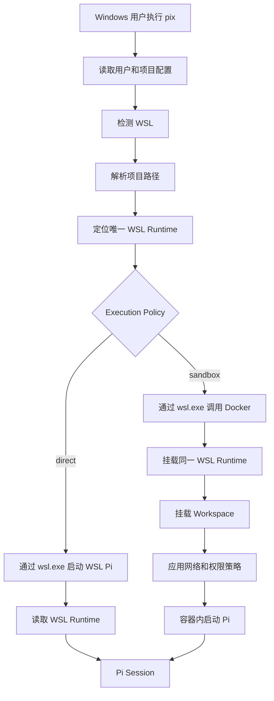

# Pix：Windows 入口、WSL 单一 Pi Runtime 与 Docker 沙箱架构

> 状态：Architecture Decision / Implementation Guidance  
> 适用环境：Windows 11 + WSL2 + Docker Desktop  
> 目标项目：`@reiutsuho/pix`

---

## 1. 方案结论

Pix 的最终定位应保持简单：

> Pix 是安装在 Windows 中的启动器。它负责根据项目配置，将 Pi 启动在 WSL 或 Docker 容器中。

本方案不继续维护 Windows 原生 Pi runtime，也不在 Windows `.pi` 与 WSL `.pi` 之间同步完整目录。

系统只维护一份位于 WSL Linux 文件系统中的 Pi runtime：

```text
/home/<wsl-user>/.pix/runtime/agent
```

这份 runtime 同时供两种执行方式使用：

```text
Direct:
Windows Pix → WSL Pi

Sandbox:
Windows Pix → WSL Docker CLI → Docker Pi
```

Windows 只作为命令入口，不再直接运行 Pi。

---

## 2. 为什么采用这个方案

当前问题来自 Windows `.pi` 被直接挂载到 Docker 容器。

插件安装后，`.pi` 中包含大量 package、Git checkout、`node_modules` 和 extension 文件。Pi 启动时会执行大量小文件操作：

```text
stat
open
read
realpath
package.json lookup
module resolution
extension discovery
```

当这些文件位于 Windows NTFS，并通过 Docker Desktop 文件共享层进入 Linux 容器时，读取性能会显著下降。

如果分别维护 Windows Pi 和 Docker Pi，则会产生：

- 两套 package 安装；
- 两套插件状态；
- 两套 session；
- Windows/Linux platform dependency 差异；
- 配置同步与冲突；
- 额外维护成本。

因此采用：

```text
一个 WSL Pi Runtime
+
两种执行策略
```

---

## 3. 总体架构



核心关系：

```text
Windows
└── Pix

WSL
├── Pi executable
├── Docker CLI
└── Canonical Pi Runtime

Docker image
└── Pi executable
```

Pi 可执行程序可以存在两份：

```text
WSL 中一份
Docker image 中一份
```

但 Pi 用户数据只存在一份：

```text
WSL Canonical Runtime
```

---

## 4. Pix 的职责

Pix 只负责启动与环境编排：

```text
Pix
├── 读取用户配置
├── 读取项目 .pix.json
├── 解析 direct / sandbox
├── 检测 WSL
├── 检测 Docker Desktop
├── 转换 Windows 与 WSL 路径
├── 定位 WSL Pi Runtime
├── 传递环境变量白名单
├── 构造 Docker 挂载参数
├── 应用网络与权限策略
├── 启动 Pi
├── 透传 stdin/stdout/stderr
└── 返回 Pi 的退出码
```

Pix 不负责：

```text
Git clone / pull / push
GitHub 配置同步
完整 .pi 目录双向同步
pnpm workspace 管理
extension build
自动合并 settings.json
package 版本协调
session 冲突处理
```

未来是否增加同步能力，应作为独立功能决策，不应影响核心启动架构。

---

## 5. Windows 的职责

Windows 只承担用户入口。

用户在 PowerShell、CMD 或 Windows Terminal 中执行：

```powershell
pix
```

或：

```powershell
pix --sandbox
```

Windows Pix 内部调用：

```powershell
wsl.exe -d Ubuntu -- ...
```

Windows 原有 Pi 可以暂时保留用于回退，但不属于新架构的主路径。

推荐最终状态：

```text
Windows
├── pix                  必须
└── pi                   可删除或保留为 legacy fallback
```

---

## 6. WSL 的职责

WSL 是实际 Linux runtime 宿主。

WSL 中需要安装：

```text
Node.js
Pi
Docker CLI
Git
可选 pnpm
```

Direct 模式由 WSL 直接启动 Pi：

```bash
export PI_CODING_AGENT_DIR="$HOME/.pix/runtime/agent"
cd "/home/<user>/projects/example"
exec pi "$@"
```

WSL 同时保存唯一的 Pi runtime。

---

## 7. Docker 的职责

Docker 只提供可选权限隔离。

Docker image 中安装 Pi 可执行程序，但不保存用户配置、插件或 session。

容器启动时挂载 WSL runtime：

```bash
docker run --rm -it   --workdir /workspace   --env PI_CODING_AGENT_DIR=/home/<user>/.pix/runtime/agent   --mount type=bind,src=/home/<user>/.pix/runtime,dst=/home/<user>/.pix/runtime   --mount type=bind,src=/home/<user>/projects/example,dst=/workspace   pix-pi-sandbox   pi
```

重要约束：

```text
Runtime 在 WSL 和 Docker 中保持相同绝对路径。
```

这样同一份 `settings.json` 中的绝对路径可以同时用于 Direct 和 Sandbox。

---

## 8. Canonical Pi Runtime

推荐目录：

```text
/home/<wsl-user>/.pix/runtime/
└── agent/
    ├── settings.json
    ├── auth.json
    ├── models.json
    ├── trust.json
    ├── sessions/
    ├── npm/
    ├── git/
    ├── extensions/
    ├── skills/
    ├── prompts/
    ├── themes/
    ├── tools/
    └── bin/
```

Pix 应为 Direct 和 Sandbox 设置：

```bash
PI_CODING_AGENT_DIR=/home/<wsl-user>/.pix/runtime/agent
```

不建议继续依赖 `/root/.pi` 作为容器独有路径，否则 Direct 和 Sandbox 的绝对路径不一致。

---

## 9. Direct 模式

Direct 模式适用于不需要 Docker 权限隔离的项目。

```text
Windows PowerShell
    ↓
pix
    ↓
wsl.exe
    ↓
WSL Pi
    ↓
WSL Canonical Runtime
```



优点：

- 无 Docker 容器启动成本；
- Pi 与插件均位于 Linux 文件系统；
- extension 读取速度快；
- 与 Sandbox 共用配置和 package。

---

## 10. Sandbox 模式

Sandbox 模式适用于：

- 审查不可信 npm package；
- 限制 Agent 文件访问；
- 限制网络访问；
- 限制系统权限；
- 防止 Agent 修改未挂载目录。

```text
Windows PowerShell
    ↓
pix --sandbox
    ↓
wsl.exe
    ↓
Docker CLI
    ↓
Pi Container
    ↓
挂载同一个 WSL Runtime
```



Sandbox 可以限制：

```text
workspace read-only/read-write
network none/bridge
Linux capabilities
memory
CPU
process count
environment variables
```

默认不应挂载：

```text
/var/run/docker.sock
整个 /home/<user>
整个 /mnt/c
Windows 用户目录
全部环境变量
SSH agent socket
```

---

## 11. 为什么不再同步 Windows `.pi`

新架构中，Windows 不再直接运行 Pi，因此 Windows `.pi` 不再是运行时的一部分。

旧结构：

```text
Windows Pi
└── C:\Users\<user>\.pi
```

新结构：

```text
WSL Pi
Docker Pi
└── /home/<user>/.pix/runtime/agent
```

因此不需要长期维护：

```text
Windows .pi ⇄ WSL .pi
```

只需要一次性迁移：

```text
Windows .pi
    ↓ one-time migration
WSL Canonical Runtime
```

迁移完成后：

```text
Windows .pi = legacy backup
WSL Runtime = 唯一权威数据源
```

---

## 12. 首次迁移策略

建议未来提供：

```powershell
pix migrate
```

迁移源：

```text
C:\Users\<windows-user>\.pi\agent
```

迁移目标：

```text
/home/<wsl-user>/.pix/runtime/agent
```

### 可以迁移

```text
settings.json
models.json
auth.json
sessions/
skills/
prompts/
themes/
自定义 extension 源码
```

### 不应直接迁移

```text
npm/
git/
node_modules/
bin/
tools/
trust.json
临时 lock
cache
```

原因：

- npm package 可能包含 Windows 平台产物；
- `node_modules` 可能包含 Windows native addon；
- Git checkout 可能包含 Windows 路径；
- `trust.json` 中保存的是 Windows 项目路径；
- bin/tool 可能是 `.exe` 或 Windows shell wrapper。

正确方式：

```text
迁移 settings 中的 package 声明
    ↓
在 WSL 中重新安装 package
```

而不是复制 Windows 安装目录。

---

## 13. Windows 与 WSL `.pi` 是否可以同步

技术上可以，但本方案不建议持续同步完整 `.pi`。

完整 `.pi` 同时包含：

```text
可移植配置
+
平台相关运行产物
+
可变运行状态
+
敏感凭据
```

可移植内容：

```text
settings.json
models.json
skills/
prompts/
themes/
extension source
```

平台相关内容：

```text
npm/
git/
node_modules/
bin/
tools/
trust.json
```

可变状态：

```text
sessions/
cache/
logs/
locks/
```

敏感数据：

```text
auth.json
API keys
OAuth tokens
```

完整双向同步需要处理：

- Windows/Linux 路径差异；
- 文件锁差异；
- 大小写敏感差异；
- native package 差异；
- 同时修改；
- 删除传播；
- session 冲突；
- auth 并发写入；
- Git checkout 冲突。

因此不符合 Pix 当前“轻量启动器”的定位。

---

## 14. 如果未来仍需要配置同步

配置同步应与 Pix Core 解耦。

### Git/GitHub

只同步可版本化配置：

```text
settings template
skills
prompts
themes
extension source
package manifest
lockfile
```

不进入 Git：

```text
auth.json
sessions
npm/
git/
node_modules/
trust.json
cache
```

### Pix 显式同步命令

未来可以增加：

```text
pix sync
pix import
pix export
```

但不得在普通 `pix` 启动时隐式执行双向同步。

### 外部脚本 Hook

Pix 只提供：

```json
{
  "hooks": {
    "preLaunch": "bash ~/.pix/scripts/pre-launch.sh"
  }
}
```

同步逻辑由用户脚本完成。

---

## 15. 项目配置

Windows 用户级配置：

```text
%USERPROFILE%\.pixrc.json
```

示例：

```json
{
  "wsl": {
    "distro": "Ubuntu",
    "runtimeRoot": "~/.pix/runtime"
  },
  "execution": "direct",
  "container": {
    "image": "pix-pi-sandbox",
    "network": "bridge",
    "runtimeAccess": "read-write",
    "workspaceAccess": "read-write"
  },
  "envAllowlist": [
    "ANTHROPIC_API_KEY",
    "ANTHROPIC_BASE_URL",
    "OPENAI_API_KEY",
    "OPENAI_BASE_URL",
    "GOOGLE_API_KEY",
    "HTTP_PROXY",
    "HTTPS_PROXY",
    "NO_PROXY",
    "DEBUG"
  ]
}
```

项目级 `.pix.json`：

```json
{
  "execution": "sandbox",
  "container": {
    "network": "none",
    "workspaceAccess": "read-write"
  }
}
```

项目只选择执行策略，不选择另一套 runtime。

---

## 16. 命令设计

建议保留：

```text
pix
pix --direct
pix --sandbox
pix status
pix doctor
pix migrate
pix --dry-run
```

### `pix status`

输出：

```text
WSL distro
runtime path
execution policy
Pi version in WSL
Pi version in Docker image
workspace path
workspace filesystem type
Docker availability
```

### `pix doctor`

检查：

- WSL 是否存在；
- distro 是否存在；
- WSL Pi 是否安装；
- Docker Desktop 是否运行；
- WSL integration 是否开启；
- runtime 是否位于 `/mnt/c`；
- workspace 是否位于 `/mnt/c`；
- Direct 和 Sandbox Pi 版本是否一致；
- runtime 是否可读写；
- Docker 是否能挂载 runtime；
- 环境变量白名单是否有效。

### `pix migrate`

只执行 Windows → WSL 一次性迁移，不做持续同步。

---

## 17. 项目目录的位置

最佳位置：

```text
/home/<wsl-user>/projects/<project>
```

Windows 可通过以下路径访问：

```text
\\wsl$\Ubuntu\home\<wsl-user>\projects\<project>
```

或：

```text
\\wsl.localhost\Ubuntu\home\<wsl-user>\projects\<project>
```

不推荐：

```text
C:\Users\<user>\projects
```

以及：

```text
/mnt/c/Users/<user>/projects
```

如果项目仍位于 Windows NTFS，则 Sandbox 中大量小文件操作仍可能较慢。

---

## 18. 安全边界

必须明确：

> Sandbox 与 Direct 共用 read-write runtime，因此 Sandbox 能修改 Pi 配置、插件、session 和 auth。

第一阶段 Sandbox 主要隔离：

```text
未挂载的宿主文件
宿主系统目录
宿主进程
网络
Linux capabilities
其他项目
```

第一阶段不隔离：

```text
共享 Pi runtime
当前 workspace
传入的凭据
显式挂载目录
```

如果未来要审查完全不可信 extension，需要增加：

```text
runtimeAccess=read-only
```

或：

```text
runtimeAccess=overlay
```

但这不属于当前核心方案。

---

## 19. Pix 实现边界

建议代码模块：

```text
bin/
└── pix.js

src/
├── config/
│   ├── load-config.js
│   ├── merge-config.js
│   └── validate-config.js
├── platform/
│   ├── windows.js
│   ├── wsl.js
│   └── paths.js
├── runtime/
│   ├── resolve-runtime.js
│   └── migrate-runtime.js
├── executors/
│   ├── direct-executor.js
│   └── sandbox-executor.js
├── docker/
│   ├── image.js
│   ├── mounts.js
│   └── policies.js
└── commands/
    ├── run.js
    ├── status.js
    ├── doctor.js
    └── migrate.js
```

不得在 Pix Core 中实现：

```text
Git repository manager
package manager abstraction
settings merge engine
双向同步数据库
extension registry
session synchronization
```

---

## 20. 验收标准

### 功能

- [ ] Pix 只需要安装在 Windows。
- [ ] Pi 安装在 WSL。
- [ ] Docker image 内包含同版本 Pi。
- [ ] Direct 与 Sandbox 使用同一个 `PI_CODING_AGENT_DIR`。
- [ ] Direct 中安装 package 后，Sandbox 立即可见。
- [ ] Sandbox 中修改 settings 后，Direct 立即可见。
- [ ] 删除 Docker 容器不会删除 runtime。
- [ ] 项目可以通过 `.pix.json` 选择 Direct 或 Sandbox。
- [ ] Windows 原生 Pi 不参与主执行路径。
- [ ] 不需要 Windows `.pi` 与 WSL `.pi` 持续同步。

### 性能

- [ ] Pi package、extension 和 `node_modules` 位于 WSL Linux 文件系统。
- [ ] Docker 不再挂载 Windows `.pi`。
- [ ] Sandbox 插件读取不再比 Direct 多约 30 秒。
- [ ] Pix 启动不执行隐式 Git 网络请求。
- [ ] Pix 启动不执行隐式 package install。

### 安全

- [ ] 默认不挂载 Docker socket。
- [ ] 默认不传递全部 Windows 环境变量。
- [ ] 支持 `network=none`。
- [ ] 支持 workspace read-only。
- [ ] CLI 明确提示共享 read-write runtime 的边界。

---

## 21. 最终逻辑



---

## 22. 最终架构定义

```text
Pix
=
Windows Pi Launcher
+
WSL Bridge
+
Docker Sandbox Launcher
```

Pix 不是：

```text
Pi package manager
Git sync tool
配置数据库
extension registry
两套 runtime 协调器
```

最终原则：

> Windows 只负责提供 Pix 命令入口。Pi 的实际运行环境位于 WSL 或 Docker。Direct 和 Sandbox 共享一份位于 WSL Linux 文件系统中的 Pi runtime，因此不需要同步 Windows `.pi` 与 WSL `.pi`。Windows 原有 `.pi` 只在首次迁移时使用，迁移完成后由 WSL runtime 成为唯一权威数据源。
